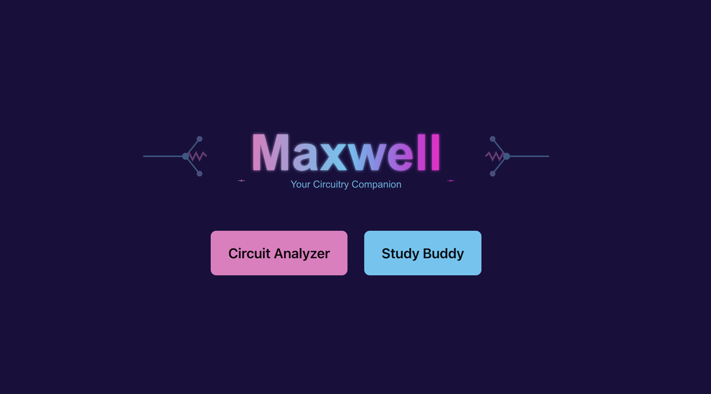
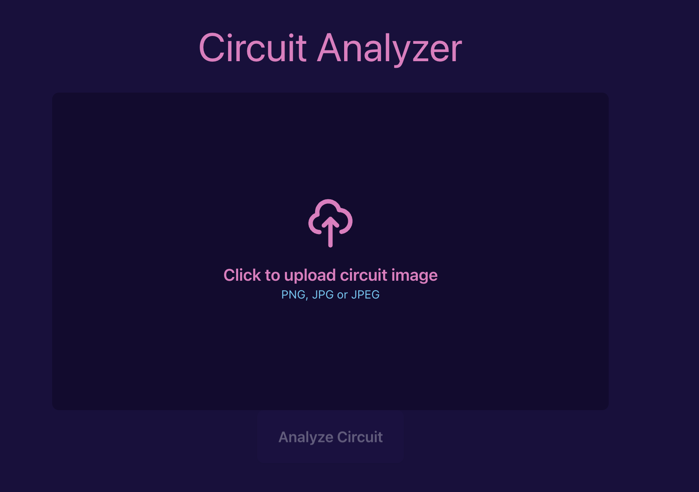
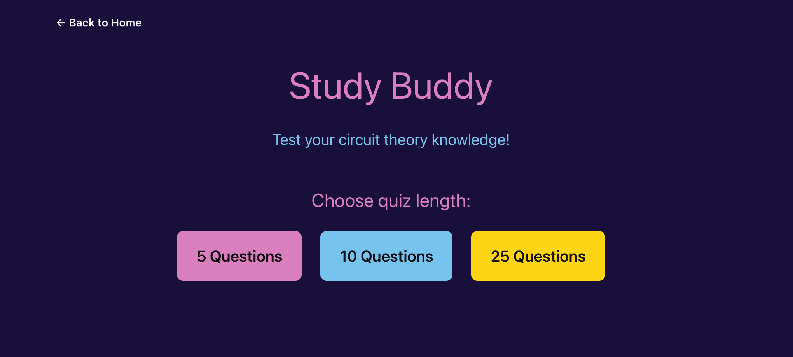
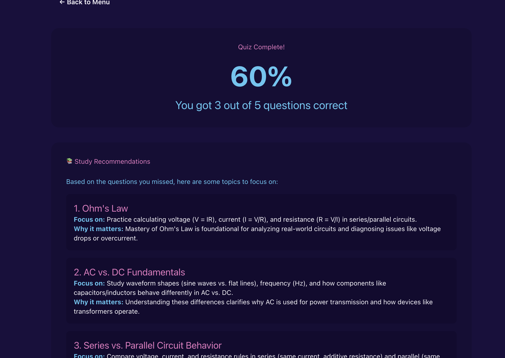

    

<h1 align="center">Maxwell</h1>

Maxwell is a circuit theory study companion, essentially a “Photomath” for electrical circuits. Powered by NVIDIA’s Nemotron Nano VL Vision-Language Model (VLM), it assists Electrical Engineering students in analyzing hand-drawn circuits and calculating complex values such as equivalent resistance, power consumption, impedance, and more.

## NVIDIA - Agents for Impact

This project was developed during NVIDIA’s [Agents for Impact Hackathon](https://luma.com/rh3ho930?utm_source=ep-2b8NYeZpFi) at Howard University. The goal was to build a tool that helps students better understand circuit theory while making a lasting positive impact on STEM education.

## Tech Stack

- **Frontend**: React.js  
- **Backend**: Node.js  
- **Vision-Language Model**: NVIDIA [Nemotron Nano VL](https://build.nvidia.com/nvidia/nemotron-nano-12b-v2-vl/modelcard) via NIM

## Features

- Image-based circuit analysis  
- Step-by-step explanations for calculations such as resistance, power, and AC parameters  
- Circuit theory quiz mode for knowledge testing  
- Feedback on which topics to review or improve

## Future Plans

The long-term goal is to make Maxwell a more comprehensive study assistant, while continuing to leverage models from NVIDIA’s NIM platform.

### Mobile Support

A mobile version would make it easier to capture circuit images and study on the go.

### User Insights

Adding user accounts will allow personalized analysis and progress tracking to help users identify strengths and weaknesses in specific electrical topics.

### Demo

Here's the demo video: <https://youtu.be/NVqEMrtUMgo>
